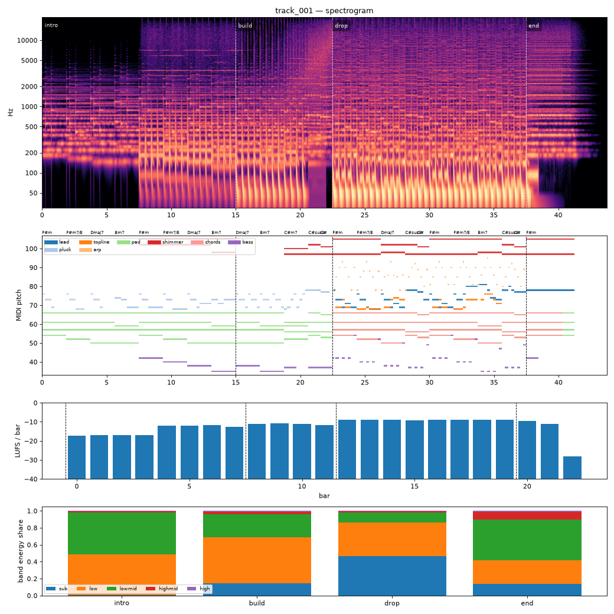

# Render report — cand_04

- song: `track_001` | key F# minor | 128 BPM | 4 sections | 43.8s
- git: `7263d4ced8` (dirty) | spec hash `058c185003bc8f1c` | seed 1001

## Layer 1 — rule checks
- **WARN** `mix.kick_bass_overlap` Kick/bass low-band overlap 0.39 _kick,bass_
- **INFO** `melody.nonchord_strong` B4 held 1 beats on strong beat over F#m (tension) _lead@beat50_
- **INFO** `melody.nonchord_strong` B4 held 1 beats on strong beat over Dmaj7 (tension) _lead@beat58_
- **INFO** `melody.nonchord_strong` E5 held 0.5 beats on strong beat over F#m (tension) _lead@beat64_
- **INFO** `melody.nonchord_strong` B4 held 1 beats on strong beat over F#m (tension) _lead@beat66_
- **INFO** `melody.nonchord_strong` E5 held 1.5 beats on strong beat over Bm7 (tension) _topline@beat73_
- **INFO** `motif.ok` Motifs repeated+transformed: ['a', 'frag'] (uses: {'a': 5, 'frag': 2}) _melody_

## Layer 2 — acoustic diagnostics (not a quality score)

| metric | value |
|---|---|
| lufs_integrated | -10.69 |
| true_peak_dbtp | -1.04 |
| peak_dbfs | -1.05 |
| rms_dbfs | -12.25 |
| crest_db | 11.20 |
| side_to_mid_db | -11.28 |
| lr_correlation | 0.86 |
| master gain into limiter (dB) | 0.54 |
| limiter max gain reduction (dB) | 5.33 |

### Sections

| section | energy tgt | LUFS | centroid Hz | rolloff Hz | onsets/s | side/mid dB | side/mid >300 Hz | sub | low | lowmid | highmid | high |
|---|---|---|---|---|---|---|---|---|---|---|---|---|
| intro | 0.3 | -13.7 | 1633 | 3056 | 2.2 | -9.1 | -7.4 | 0.002 | 0.488 | 0.490 | 0.018 | 0.003 |
| build | 0.6 | -11.2 | 2363 | 4761 | 3.6 | -12.6 | -8.4 | 0.147 | 0.537 | 0.275 | 0.027 | 0.012 |
| drop | 1.0 | -8.9 | 3152 | 7769 | 3.9 | -12.6 | -4.4 | 0.468 | 0.398 | 0.114 | 0.016 | 0.004 |
| end | 0.4 | -10.2 | 3888 | 8979 | 0.0 | -6.8 | -4.9 | 0.135 | 0.281 | 0.482 | 0.088 | 0.015 |

### Section contrast
- intro → build: ΔLUFS 2.6, Δcentroid 730 Hz, Δonsets/s 1.4, Δwidth -3.5 dB (>300 Hz: -1.0 dB)
- build → drop: ΔLUFS 2.3, Δcentroid 788 Hz, Δonsets/s 0.3, Δwidth -0.0 dB (>300 Hz: 4.0 dB)
- drop → end: ΔLUFS -1.3, Δcentroid 736 Hz, Δonsets/s -3.9, Δwidth 5.8 dB (>300 Hz: -0.5 dB)

### Loudness by bar (LUFS)

0:-17 1:-17 2:-17 3:-17 4:-12 5:-12 6:-12 7:-13 8:-11 9:-11 10:-11 11:-12 12:-9 13:-9 14:-9 15:-9 16:-9 17:-9 18:-9 19:-9 20:-9 21:-11 22:-28 23:–

### Stem diagnostics
- kick_bass: low_overlap_ratio=0.392, kick_to_bass_low_db=11.588
- lead_presence: lead_to_rest_1k5k_db=3.471, active_fraction=0.421
- low_end_stereo: side_to_mid_db=-29.039, lr_correlation=0.998

### Tonality
- declared: F# minor (rank 1); estimate: F# minor (0.90), A major (0.67), C# minor (0.60)

## Layer 3 / 4
Critic reviews go to `critiques/`, human A/B choices to `feedback/preferences.jsonl`.

