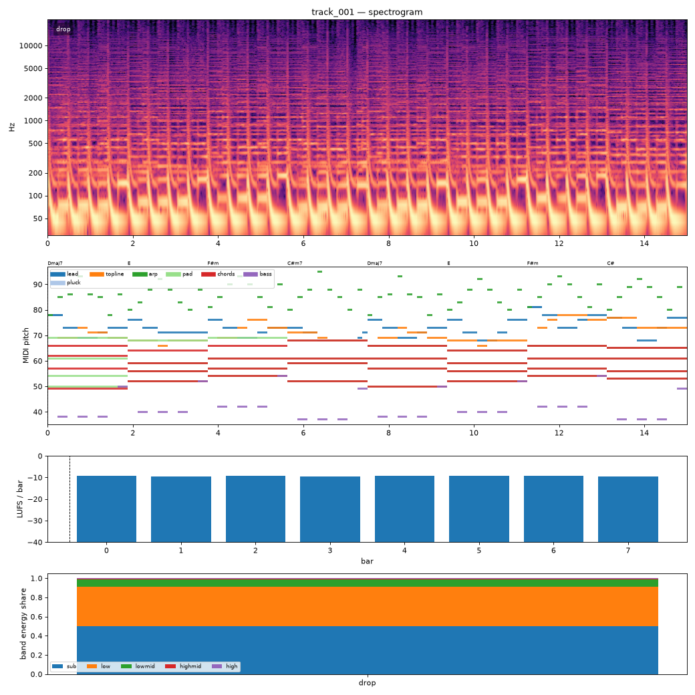

# Render report — cand_00

- song: `track_001` | key F# minor | 128 BPM | 1 sections | 15.0s
- git: `7d65286cd7` (dirty) | spec hash `d611639ce43c8d81` | seed 1001

## Layer 1 — rule checks
- **WARN** `range` 1 notes outside topline range G3-F5 (e.g. F#5 at beat 73.5) _topline_
- **INFO** `melody.nonchord_strong` E5 held 0.75 beats on strong beat over F#m (tension) _lead@beat56_
- **INFO** `melody.nonchord_strong` B4 held 1 beats on strong beat over Dmaj7 (tension) _topline@beat50_
- **INFO** `melody.nonchord_strong` E5 held 1 beats on strong beat over F#m (tension) _topline@beat58_
- **INFO** `melody.nonchord_strong` B4 held 1 beats on strong beat over Dmaj7 (tension) _topline@beat66_
- **INFO** `melody.nonchord_strong` E5 held 0.5 beats on strong beat over F#m (tension) _topline@beat73_
- **INFO** `melody.nonchord_strong` E5 held 1 beats on strong beat over F#m (tension) _topline@beat75_
- **INFO** `motif.ok` Motifs repeated+transformed: ['a'] (uses: {'a': 10, 'frag': 2}) _melody_

## Layer 2 — acoustic diagnostics (not a quality score)

| metric | value |
|---|---|
| lufs_integrated | -9.23 |
| true_peak_dbtp | -1.04 |
| peak_dbfs | -1.05 |
| rms_dbfs | -9.42 |
| crest_db | 8.37 |
| side_to_mid_db | -16.18 |
| lr_correlation | 0.95 |
| master gain into limiter (dB) | 2.10 |
| limiter max gain reduction (dB) | 4.47 |

### Sections

| section | energy tgt | LUFS | centroid Hz | rolloff Hz | onsets/s | side/mid dB | side/mid >300 Hz | sub | low | lowmid | highmid | high |
|---|---|---|---|---|---|---|---|---|---|---|---|---|
| drop | 1.0 | -9.2 | 2556 | 5971 | 3.3 | -16.2 | -6.5 | 0.499 | 0.412 | 0.079 | 0.009 | 0.002 |

### Section contrast

### Loudness by bar (LUFS)

0:-9 1:-9 2:-9 3:-9 4:-9 5:-9 6:-9 7:-9

### Tonality
- declared: F# minor (rank 2); estimate: C# minor (0.62), F# minor (0.56), A major (0.56)

## Layer 3 / 4
Critic reviews go to `critiques/`, human A/B choices to `feedback/preferences.jsonl`.

