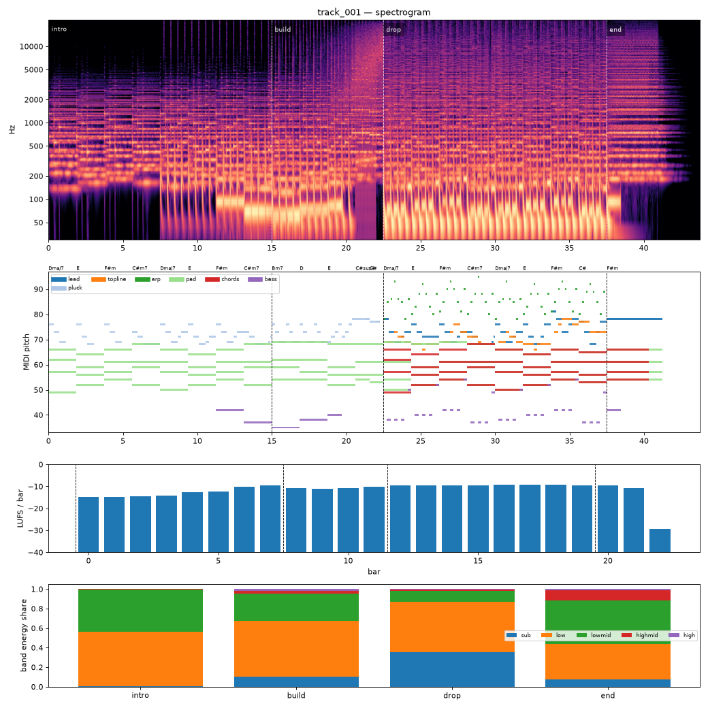

# Render report — cand_00

- song: `track_001` | key F# minor | 128 BPM | 4 sections | 43.8s
- git: `b5d33a4848` (dirty) | spec hash `e8c0ba6ae773137b` | seed 1001

## Layer 1 — rule checks
- **WARN** `range` 1 notes outside topline range G3-F5 (e.g. F#5 at beat 73.5) _topline_
- **WARN** `arrangement.energy_order` Energy target drop=1.0 vs end=0.4 but loudness -9.3 vs -10.1 LUFS _drop->end_
- **INFO** `melody.nonchord_strong` E5 held 0.75 beats on strong beat over F#m (tension) _lead@beat56_
- **INFO** `melody.nonchord_strong` B4 held 1 beats on strong beat over Dmaj7 (tension) _topline@beat50_
- **INFO** `melody.nonchord_strong` E5 held 1 beats on strong beat over F#m (tension) _topline@beat58_
- **INFO** `melody.nonchord_strong` B4 held 1 beats on strong beat over Dmaj7 (tension) _topline@beat66_
- **INFO** `melody.nonchord_strong` E5 held 0.5 beats on strong beat over F#m (tension) _topline@beat73_
- **INFO** `melody.nonchord_strong` E5 held 1 beats on strong beat over F#m (tension) _topline@beat75_
- **INFO** `motif.ok` Motifs repeated+transformed: ['a'] (uses: {'a': 10, 'frag': 2}) _melody_

## Layer 2 — acoustic diagnostics (not a quality score)

| metric | value |
|---|---|
| lufs_integrated | -10.56 |
| true_peak_dbtp | -1.04 |
| peak_dbfs | -1.05 |
| rms_dbfs | -12.18 |
| crest_db | 11.13 |
| side_to_mid_db | -11.57 |
| lr_correlation | 0.87 |
| master gain into limiter (dB) | 2.74 |
| limiter max gain reduction (dB) | 7.05 |

### Sections

| section | energy tgt | LUFS | centroid Hz | rolloff Hz | onsets/s | side/mid dB | sub | low | lowmid | highmid | high |
|---|---|---|---|---|---|---|---|---|---|---|---|
| intro | 0.3 | -12.4 | 935 | 1713 | 3.0 | -9.4 | 0.008 | 0.553 | 0.436 | 0.004 | 0.000 |
| build | 0.6 | -10.6 | 2253 | 4453 | 5.5 | -11.6 | 0.103 | 0.571 | 0.281 | 0.029 | 0.016 |
| drop | 1.0 | -9.3 | 2746 | 6398 | 4.7 | -14.1 | 0.351 | 0.517 | 0.116 | 0.013 | 0.002 |
| end | 0.4 | -10.1 | 3525 | 8029 | 0.0 | -7.1 | 0.077 | 0.364 | 0.446 | 0.100 | 0.013 |

### Section contrast
- intro → build: ΔLUFS 1.8, Δcentroid 1318 Hz, Δonsets/s 2.5, Δwidth -2.2 dB
- build → drop: ΔLUFS 1.3, Δcentroid 492 Hz, Δonsets/s -0.8, Δwidth -2.5 dB
- drop → end: ΔLUFS -0.8, Δcentroid 779 Hz, Δonsets/s -4.7, Δwidth 7.0 dB

### Loudness by bar (LUFS)

0:-15 1:-15 2:-15 3:-14 4:-13 5:-12 6:-10 7:-10 8:-11 9:-11 10:-11 11:-10 12:-10 13:-10 14:-9 15:-10 16:-9 17:-9 18:-9 19:-9 20:-10 21:-11 22:-29 23:–

### Stem diagnostics
- kick_bass: low_overlap_ratio=0.118, kick_to_bass_low_db=4.521
- lead_presence: lead_to_rest_1k5k_db=3.748, active_fraction=0.416
- low_end_stereo: side_to_mid_db=-30.810, lr_correlation=0.998

### Tonality
- declared: F# minor (rank 1); estimate: F# minor (0.79), C# minor (0.72), A major (0.64)

## Layer 3 / 4
Critic reviews go to `critiques/`, human A/B choices to `feedback/preferences.jsonl`.

