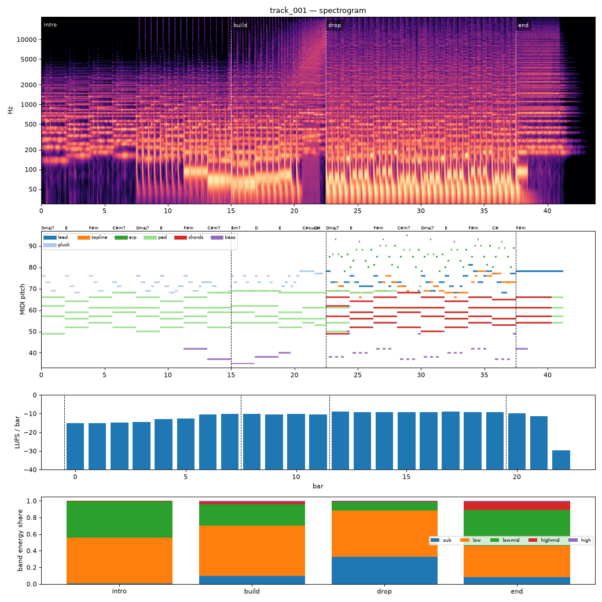

# Render report — cand_02

- song: `track_001` | key F# minor | 128 BPM | 4 sections | 43.8s
- git: `b5d33a4848` (dirty) | spec hash `10a025ff034c150d` | seed 1001

## Layer 1 — rule checks
- **WARN** `range` 1 notes outside topline range G3-F5 (e.g. F#5 at beat 73.5) _topline_
- **INFO** `melody.nonchord_strong` E5 held 0.75 beats on strong beat over F#m (tension) _lead@beat56_
- **INFO** `melody.nonchord_strong` B4 held 1 beats on strong beat over Dmaj7 (tension) _topline@beat50_
- **INFO** `melody.nonchord_strong` E5 held 1 beats on strong beat over F#m (tension) _topline@beat58_
- **INFO** `melody.nonchord_strong` B4 held 1 beats on strong beat over Dmaj7 (tension) _topline@beat66_
- **INFO** `melody.nonchord_strong` E5 held 0.5 beats on strong beat over F#m (tension) _topline@beat73_
- **INFO** `melody.nonchord_strong` E5 held 1 beats on strong beat over F#m (tension) _topline@beat75_
- **INFO** `motif.ok` Motifs repeated+transformed: ['a'] (uses: {'a': 10, 'frag': 2}) _melody_

## Layer 2 — acoustic diagnostics (not a quality score)

| metric | value |
|---|---|
| lufs_integrated | -10.50 |
| true_peak_dbtp | -1.04 |
| peak_dbfs | -1.05 |
| rms_dbfs | -12.07 |
| crest_db | 11.02 |
| side_to_mid_db | -12.11 |
| lr_correlation | 0.88 |
| master gain into limiter (dB) | -4.02 |
| limiter max gain reduction (dB) | 0.06 |

### Sections

| section | energy tgt | LUFS | centroid Hz | rolloff Hz | onsets/s | side/mid dB | sub | low | lowmid | highmid | high |
|---|---|---|---|---|---|---|---|---|---|---|---|
| intro | 0.3 | -12.8 | 936 | 1706 | 3.0 | -9.4 | 0.008 | 0.549 | 0.440 | 0.004 | 0.000 |
| build | 0.6 | -10.3 | 2188 | 4368 | 5.1 | -12.3 | 0.093 | 0.613 | 0.256 | 0.025 | 0.013 |
| drop | 1.0 | -9.1 | 2630 | 6092 | 4.3 | -14.8 | 0.329 | 0.557 | 0.100 | 0.011 | 0.002 |
| end | 0.4 | -10.6 | 3471 | 7909 | 0.0 | -7.3 | 0.082 | 0.375 | 0.432 | 0.097 | 0.013 |

### Section contrast
- intro → build: ΔLUFS 2.5, Δcentroid 1252 Hz, Δonsets/s 2.1, Δwidth -2.9 dB
- build → drop: ΔLUFS 1.2, Δcentroid 441 Hz, Δonsets/s -0.7, Δwidth -2.6 dB
- drop → end: ΔLUFS -1.5, Δcentroid 841 Hz, Δonsets/s -4.3, Δwidth 7.5 dB

### Loudness by bar (LUFS)

0:-15 1:-15 2:-15 3:-14 4:-13 5:-12 6:-11 7:-10 8:-10 9:-10 10:-10 11:-10 12:-9 13:-9 14:-9 15:-9 16:-9 17:-9 18:-9 19:-9 20:-10 21:-11 22:-30 23:–

### Stem diagnostics
- kick_bass: low_overlap_ratio=0.118, kick_to_bass_low_db=4.521
- lead_presence: lead_to_rest_1k5k_db=3.748, active_fraction=0.416
- low_end_stereo: side_to_mid_db=-30.810, lr_correlation=0.998

### Tonality
- declared: F# minor (rank 1); estimate: F# minor (0.79), C# minor (0.72), A major (0.64)

## Layer 3 / 4
Critic reviews go to `critiques/`, human A/B choices to `feedback/preferences.jsonl`.

