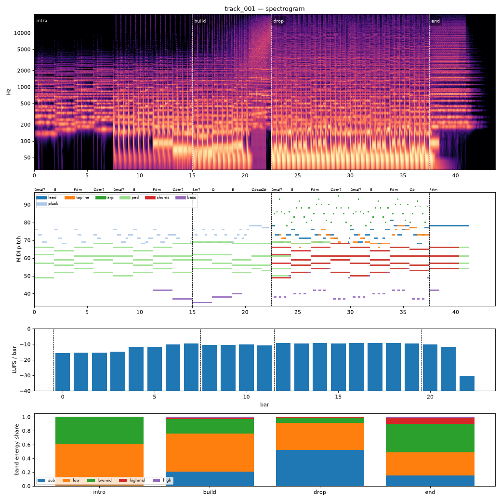

# Render report — cand_01

- song: `track_001` | key F# minor | 128 BPM | 4 sections | 43.8s
- git: `b5d33a4848` (dirty) | spec hash `1d9ea49d4e7f5dec` | seed 1001

## Layer 1 — rule checks
- **WARN** `range` 1 notes outside topline range G3-F5 (e.g. F#5 at beat 73.5) _topline_
- **WARN** `mix.kick_bass_overlap` Kick/bass low-band overlap 0.41 _kick,bass_
- **INFO** `melody.nonchord_strong` E5 held 0.75 beats on strong beat over F#m (tension) _lead@beat56_
- **INFO** `melody.nonchord_strong` B4 held 1 beats on strong beat over Dmaj7 (tension) _topline@beat50_
- **INFO** `melody.nonchord_strong` E5 held 1 beats on strong beat over F#m (tension) _topline@beat58_
- **INFO** `melody.nonchord_strong` B4 held 1 beats on strong beat over Dmaj7 (tension) _topline@beat66_
- **INFO** `melody.nonchord_strong` E5 held 0.5 beats on strong beat over F#m (tension) _topline@beat73_
- **INFO** `melody.nonchord_strong` E5 held 1 beats on strong beat over F#m (tension) _topline@beat75_
- **INFO** `motif.ok` Motifs repeated+transformed: ['a'] (uses: {'a': 10, 'frag': 2}) _melody_

## Layer 2 — acoustic diagnostics (not a quality score)

| metric | value |
|---|---|
| lufs_integrated | -10.56 |
| true_peak_dbtp | -1.04 |
| peak_dbfs | -1.05 |
| rms_dbfs | -11.71 |
| crest_db | 10.66 |
| side_to_mid_db | -13.29 |
| lr_correlation | 0.91 |
| master gain into limiter (dB) | 1.96 |
| limiter max gain reduction (dB) | 4.02 |

### Sections

| section | energy tgt | LUFS | centroid Hz | rolloff Hz | onsets/s | side/mid dB | sub | low | lowmid | highmid | high |
|---|---|---|---|---|---|---|---|---|---|---|---|
| intro | 0.3 | -12.4 | 841 | 1520 | 2.9 | -10.4 | 0.008 | 0.594 | 0.395 | 0.003 | 0.000 |
| build | 0.6 | -10.5 | 1996 | 3934 | 4.5 | -13.2 | 0.210 | 0.544 | 0.213 | 0.021 | 0.012 |
| drop | 1.0 | -9.2 | 2508 | 5828 | 2.5 | -16.6 | 0.520 | 0.394 | 0.076 | 0.008 | 0.002 |
| end | 0.4 | -10.8 | 3362 | 7678 | 0.0 | -7.5 | 0.151 | 0.335 | 0.410 | 0.092 | 0.012 |

### Section contrast
- intro → build: ΔLUFS 1.9, Δcentroid 1155 Hz, Δonsets/s 1.7, Δwidth -2.8 dB
- build → drop: ΔLUFS 1.2, Δcentroid 512 Hz, Δonsets/s -2.0, Δwidth -3.4 dB
- drop → end: ΔLUFS -1.6, Δcentroid 854 Hz, Δonsets/s -2.5, Δwidth 9.2 dB

### Loudness by bar (LUFS)

0:-16 1:-15 2:-15 3:-15 4:-12 5:-12 6:-10 7:-9 8:-11 9:-10 10:-10 11:-11 12:-9 13:-9 14:-9 15:-9 16:-9 17:-9 18:-9 19:-9 20:-10 21:-12 22:-30 23:–

### Stem diagnostics
- kick_bass: low_overlap_ratio=0.409, kick_to_bass_low_db=8.520
- lead_presence: lead_to_rest_1k5k_db=2.966, active_fraction=0.416
- low_end_stereo: side_to_mid_db=-33.023, lr_correlation=0.999

### Tonality
- declared: F# minor (rank 1); estimate: F# minor (0.79), C# minor (0.72), A major (0.64)

## Layer 3 / 4
Critic reviews go to `critiques/`, human A/B choices to `feedback/preferences.jsonl`.

