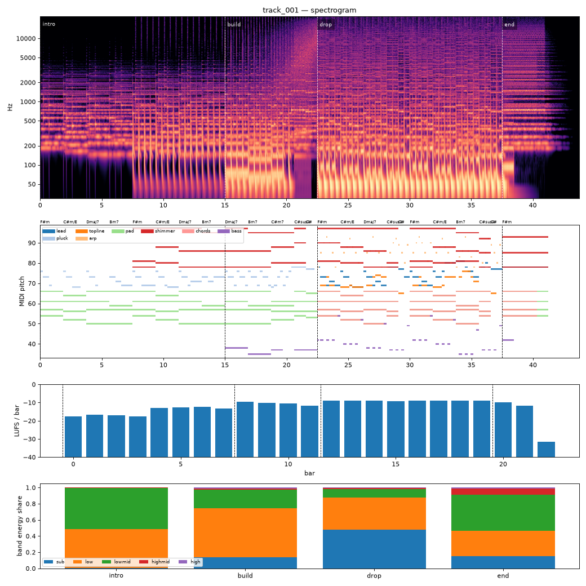

# Render report — cand_01

- song: `track_001` | key F# minor | 128 BPM | 4 sections | 43.8s
- git: `fe3d64d983` (dirty) | spec hash `59aa4d2ac54bbc0a` | seed 1001

## Layer 1 — rule checks
- **WARN** `mix.kick_bass_overlap` Kick/bass low-band overlap 0.39 _kick,bass_
- **INFO** `melody.nonchord_strong` B4 held 1 beats on strong beat over F#m (tension) _lead@beat50_
- **INFO** `melody.nonchord_strong` B4 held 1 beats on strong beat over Dmaj7 (tension) _lead@beat58_
- **INFO** `melody.nonchord_strong` E5 held 0.5 beats on strong beat over F#m (tension) _lead@beat64_
- **INFO** `melody.nonchord_strong` B4 held 1 beats on strong beat over F#m (tension) _lead@beat66_
- **INFO** `melody.nonchord_strong` E5 held 1 beats on strong beat over Bm7 (tension) _lead@beat74_
- **INFO** `melody.nonchord_strong` E5 held 1.5 beats on strong beat over Bm7 (tension) _topline@beat73_
- **INFO** `motif.ok` Motifs repeated+transformed: ['a'] (uses: {'a': 5, 'frag': 2}) _melody_

## Layer 2 — acoustic diagnostics (not a quality score)

| metric | value |
|---|---|
| lufs_integrated | -10.69 |
| true_peak_dbtp | -1.04 |
| peak_dbfs | -1.05 |
| rms_dbfs | -12.08 |
| crest_db | 11.03 |
| side_to_mid_db | -11.93 |
| lr_correlation | 0.88 |
| master gain into limiter (dB) | 0.67 |
| limiter max gain reduction (dB) | 4.95 |

### Sections

| section | energy tgt | LUFS | centroid Hz | rolloff Hz | onsets/s | side/mid dB | side/mid >300 Hz | sub | low | lowmid | highmid | high |
|---|---|---|---|---|---|---|---|---|---|---|---|---|
| intro | 0.3 | -14.4 | 780 | 1434 | 2.5 | -8.8 | -7.5 | 0.002 | 0.487 | 0.507 | 0.003 | 0.000 |
| build | 0.6 | -10.3 | 1961 | 3878 | 4.0 | -13.8 | -8.8 | 0.135 | 0.606 | 0.230 | 0.020 | 0.010 |
| drop | 1.0 | -8.9 | 3046 | 7568 | 4.1 | -13.5 | -5.0 | 0.477 | 0.401 | 0.107 | 0.012 | 0.003 |
| end | 0.4 | -10.8 | 3705 | 8668 | 0.0 | -6.6 | -4.5 | 0.153 | 0.313 | 0.447 | 0.075 | 0.012 |

### Section contrast
- intro → build: ΔLUFS 4.0, Δcentroid 1181 Hz, Δonsets/s 1.5, Δwidth -5.0 dB (>300 Hz: -1.4 dB)
- build → drop: ΔLUFS 1.5, Δcentroid 1084 Hz, Δonsets/s 0.1, Δwidth 0.4 dB (>300 Hz: 3.8 dB)
- drop → end: ΔLUFS -1.9, Δcentroid 659 Hz, Δonsets/s -4.1, Δwidth 6.9 dB (>300 Hz: 0.5 dB)

### Loudness by bar (LUFS)

0:-18 1:-17 2:-17 3:-17 4:-13 5:-13 6:-12 7:-13 8:-9 9:-10 10:-10 11:-12 12:-9 13:-9 14:-9 15:-9 16:-9 17:-9 18:-9 19:-9 20:-10 21:-12 22:-31 23:–

### Stem diagnostics
- kick_bass: low_overlap_ratio=0.393, kick_to_bass_low_db=9.701
- lead_presence: lead_to_rest_1k5k_db=4.599, active_fraction=0.421
- low_end_stereo: side_to_mid_db=-29.205, lr_correlation=0.998

### Tonality
- declared: F# minor (rank 1); estimate: F# minor (0.83), C# minor (0.72), A major (0.65)

## Layer 3 / 4
Critic reviews go to `critiques/`, human A/B choices to `feedback/preferences.jsonl`.

