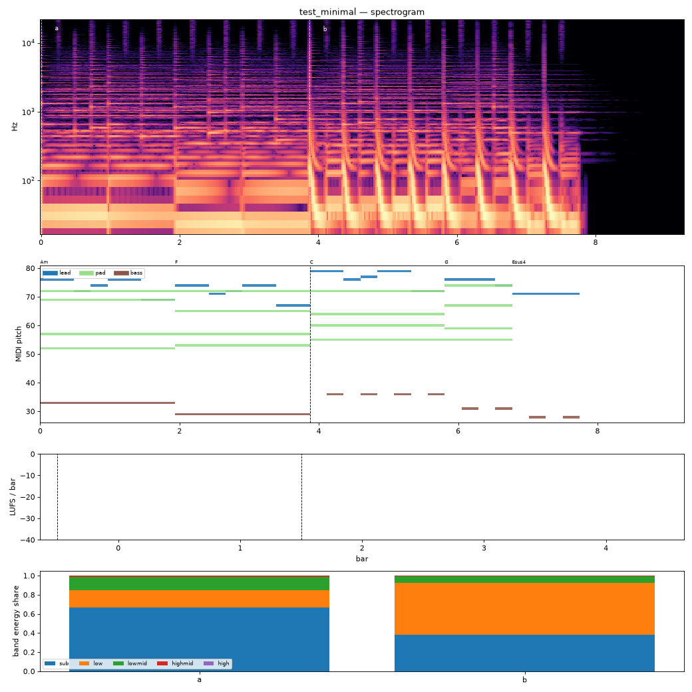

# Render report — test_minimal_v002

- song: `test_minimal` | key A minor | 124 BPM | 2 sections | 9.2s
- git: `37ec62459b` (dirty) | spec hash `1091090ec585b9df` | seed 7

## Layer 1 — rule checks
- **WARN** `melody.nonchord_strong` B4 held 0.5 beats on strong beat over F (semitone clash) _lead@beat5_
- **INFO** `melody.nonchord_strong` D5 held 1 beats on strong beat over F (tension) _lead@beat4_
- **INFO** `melody.nonchord_strong` D5 held 1 beats on strong beat over F (tension) _lead@beat6_
- **INFO** `melody.nonchord_strong` E5 held 1.5 beats on strong beat over G (tension) _lead@beat12_
- **INFO** `motif.ok` Motifs repeated+transformed: ['m'] (uses: {'m': 3}) _melody_

## Layer 2 — acoustic diagnostics (not a quality score)

| metric | value |
|---|---|
| lufs_integrated | -11.06 |
| true_peak_dbtp | -1.04 |
| peak_dbfs | -1.05 |
| rms_dbfs | -11.92 |
| crest_db | 10.87 |
| side_to_mid_db | -17.87 |
| lr_correlation | 0.97 |
| master gain into limiter (dB) | -3.29 |
| limiter max gain reduction (dB) | 1.34 |

### Sections

| section | energy tgt | LUFS | centroid Hz | rolloff Hz | onsets/s | side/mid dB | sub | low | lowmid | highmid | high |
|---|---|---|---|---|---|---|---|---|---|---|---|
| a | 0.4 | -13.0 | 191 | 284 | 2.6 | -15.4 | 0.668 | 0.180 | 0.143 | 0.008 | 0.001 |
| b | 0.9 | -9.7 | 135 | 141 | 2.3 | -19.9 | 0.382 | 0.542 | 0.071 | 0.003 | 0.000 |

### Section contrast
- a → b: ΔLUFS 3.3, Δcentroid -56 Hz, Δonsets/s -0.3, Δwidth -4.5 dB

### Loudness by bar (LUFS)

0:-13 1:-13 2:-9 3:-10 4:-35

### Stem diagnostics
- kick_bass: low_overlap_ratio=0.028, kick_to_bass_low_db=-2.522
- lead_presence: lead_to_rest_1k5k_db=6.203, active_fraction=0.714
- low_end_stereo: side_to_mid_db=-35.171, lr_correlation=0.999

### Tonality
- declared: A minor (rank 3); estimate: C major (0.83), F major (0.66), A minor (0.60)

## Layer 3 / 4
Critic reviews go to `critiques/`, human A/B choices to `feedback/preferences.jsonl`.

