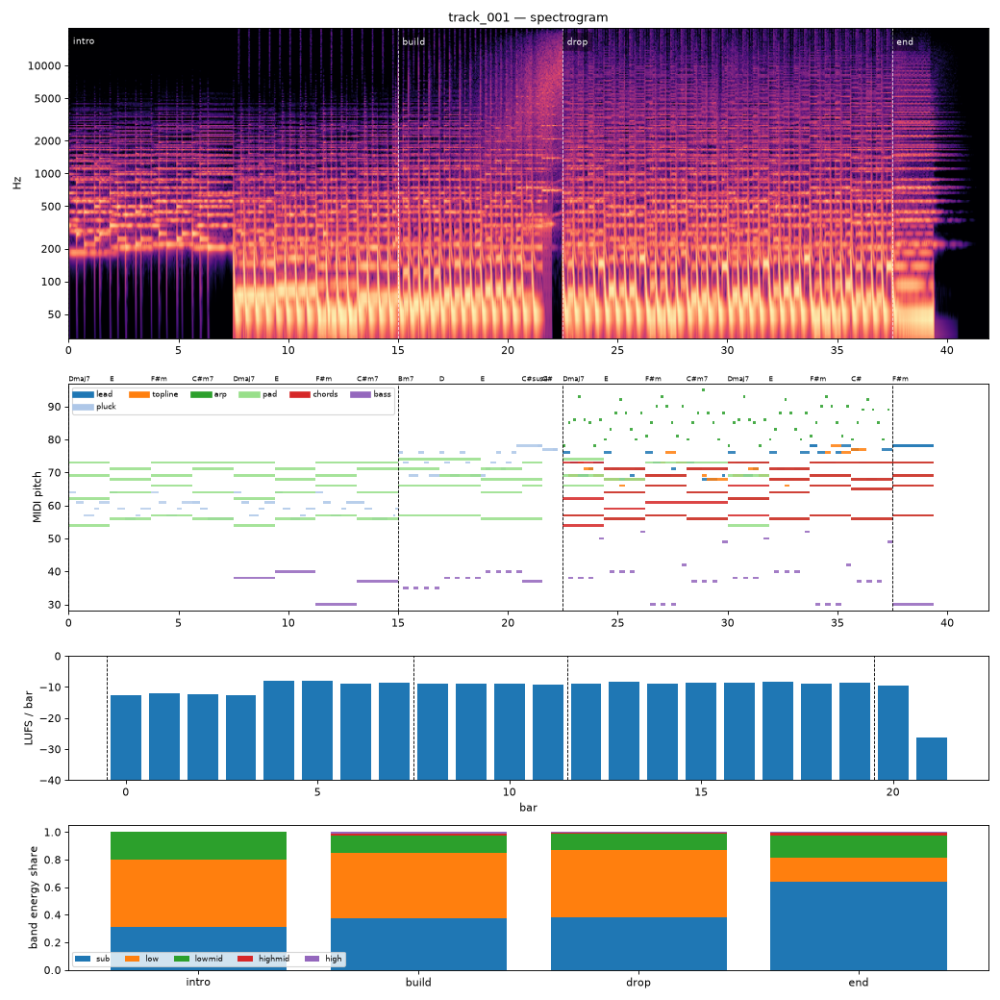

# Render report — track_001_v001

- song: `track_001` | key F# minor | 128 BPM | 4 sections | 41.9s
- git: `37ec62459b` (dirty) | spec hash `1d4c0603acbe0577` | seed 1001

## Layer 1 — rule checks
- **WARN** `range` 1 notes outside topline range G3-F5 (e.g. F#5 at beat 74) _topline_
- **WARN** `arrangement.energy_order` Energy target build=0.6 vs drop=1.0 but loudness -9.0 vs -8.5 LUFS _build->drop_
- **INFO** `melody.nonchord_strong` E5 held 0.75 beats on strong beat over F#m (tension) _lead@beat56_
- **INFO** `melody.nonchord_strong` B4 held 1 beats on strong beat over Dmaj7 (tension) _topline@beat50_
- **INFO** `melody.nonchord_strong` E5 held 1 beats on strong beat over F#m (tension) _topline@beat58_
- **INFO** `melody.nonchord_strong` B4 held 1 beats on strong beat over Dmaj7 (tension) _topline@beat66_
- **INFO** `melody.nonchord_strong` E5 held 1 beats on strong beat over F#m (tension) _topline@beat75_
- **INFO** `motif.ok` Motifs repeated+transformed: ['a'] (uses: {'a': 11, 'frag': 2}) _melody_

## Layer 2 — acoustic diagnostics (not a quality score)

| metric | value |
|---|---|
| lufs_integrated | -9.17 |
| true_peak_dbtp | -1.04 |
| peak_dbfs | -1.05 |
| rms_dbfs | -10.11 |
| crest_db | 9.06 |
| side_to_mid_db | -14.82 |
| lr_correlation | 0.94 |
| master gain into limiter (dB) | 4.52 |
| limiter max gain reduction (dB) | 7.38 |

### Sections

| section | energy tgt | LUFS | centroid Hz | rolloff Hz | onsets/s | side/mid dB | side/mid >300 Hz | sub | low | lowmid | highmid | high |
|---|---|---|---|---|---|---|---|---|---|---|---|---|
| intro | 0.3 | -10.0 | 611 | 952 | 3.1 | -14.2 | -7.9 | 0.312 | 0.491 | 0.196 | 0.001 | 0.000 |
| build | 0.6 | -9.0 | 1759 | 3469 | 5.3 | -15.3 | -7.2 | 0.374 | 0.477 | 0.125 | 0.014 | 0.010 |
| drop | 1.0 | -8.5 | 2320 | 5150 | 4.3 | -15.3 | -6.6 | 0.379 | 0.492 | 0.116 | 0.011 | 0.002 |
| end | 0.5 | -9.5 | 2426 | 5658 | 2.1 | -13.6 | -6.4 | 0.639 | 0.172 | 0.160 | 0.026 | 0.003 |

### Section contrast
- intro → build: ΔLUFS 1.0, Δcentroid 1148 Hz, Δonsets/s 2.2, Δwidth -1.1 dB (>300 Hz: 0.7 dB)
- build → drop: ΔLUFS 0.4, Δcentroid 561 Hz, Δonsets/s -1.1, Δwidth 0.0 dB (>300 Hz: 0.6 dB)
- drop → end: ΔLUFS -1.0, Δcentroid 106 Hz, Δonsets/s -2.1, Δwidth 1.7 dB (>300 Hz: 0.2 dB)

### Loudness by bar (LUFS)

0:-13 1:-12 2:-12 3:-13 4:-8 5:-8 6:-9 7:-9 8:-9 9:-9 10:-9 11:-9 12:-9 13:-8 14:-9 15:-9 16:-8 17:-8 18:-9 19:-9 20:-10 21:-26 22:–

### Stem diagnostics
- kick_bass: low_overlap_ratio=0.251, kick_to_bass_low_db=5.516
- lead_presence: lead_to_rest_1k5k_db=1.187, active_fraction=0.395
- low_end_stereo: side_to_mid_db=-39.750, lr_correlation=1.000

### Tonality
- declared: F# minor (rank 3); estimate: C# minor (0.78), A major (0.75), F# minor (0.67)

## Layer 3 / 4
Critic reviews go to `critiques/`, human A/B choices to `feedback/preferences.jsonl`.

