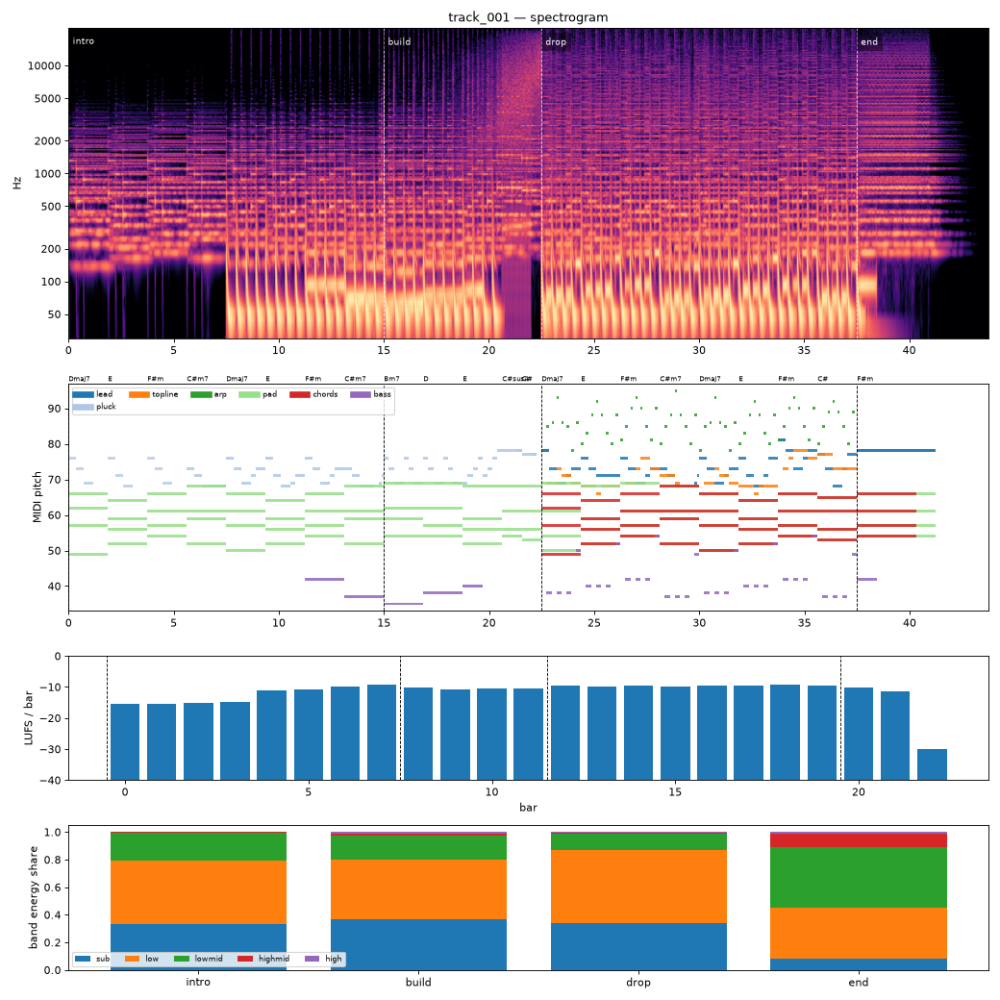

# Render report — track_001_v002

- song: `track_001` | key F# minor | 128 BPM | 4 sections | 43.8s
- git: `b5d33a4848` (dirty) | spec hash `ac9ae7c33ac2e488` | seed 1001

## Layer 1 — rule checks
- **WARN** `range` 1 notes outside topline range G3-F5 (e.g. F#5 at beat 73.5) _topline_
- **INFO** `melody.nonchord_strong` E5 held 0.75 beats on strong beat over F#m (tension) _lead@beat56_
- **INFO** `melody.nonchord_strong` B4 held 1 beats on strong beat over Dmaj7 (tension) _topline@beat50_
- **INFO** `melody.nonchord_strong` E5 held 1 beats on strong beat over F#m (tension) _topline@beat58_
- **INFO** `melody.nonchord_strong` B4 held 1 beats on strong beat over Dmaj7 (tension) _topline@beat66_
- **INFO** `melody.nonchord_strong` E5 held 0.5 beats on strong beat over F#m (tension) _topline@beat73_
- **INFO** `melody.nonchord_strong` E5 held 1 beats on strong beat over F#m (tension) _topline@beat75_
- **INFO** `motif.ok` Motifs repeated+transformed: ['a'] (uses: {'a': 10, 'frag': 2}) _melody_

## Layer 2 — acoustic diagnostics (not a quality score)

| metric | value |
|---|---|
| lufs_integrated | -10.55 |
| true_peak_dbtp | -1.04 |
| peak_dbfs | -1.05 |
| rms_dbfs | -11.75 |
| crest_db | 10.70 |
| side_to_mid_db | -12.88 |
| lr_correlation | 0.90 |
| master gain into limiter (dB) | 2.10 |
| limiter max gain reduction (dB) | 6.19 |

### Sections

| section | energy tgt | LUFS | centroid Hz | rolloff Hz | onsets/s | side/mid dB | side/mid >300 Hz | sub | low | lowmid | highmid | high |
|---|---|---|---|---|---|---|---|---|---|---|---|---|
| intro | 0.3 | -12.0 | 638 | 1060 | 2.7 | -12.4 | -7.1 | 0.330 | 0.462 | 0.207 | 0.002 | 0.000 |
| build | 0.6 | -10.5 | 1744 | 3347 | 5.7 | -13.9 | -7.3 | 0.365 | 0.436 | 0.170 | 0.018 | 0.010 |
| drop | 1.0 | -9.5 | 2579 | 5934 | 4.5 | -14.3 | -6.2 | 0.339 | 0.533 | 0.114 | 0.013 | 0.002 |
| end | 0.4 | -10.7 | 3492 | 7967 | 0.0 | -7.2 | -5.3 | 0.084 | 0.371 | 0.435 | 0.098 | 0.013 |

### Section contrast
- intro → build: ΔLUFS 1.5, Δcentroid 1106 Hz, Δonsets/s 3.1, Δwidth -1.5 dB (>300 Hz: -0.3 dB)
- build → drop: ΔLUFS 1.0, Δcentroid 835 Hz, Δonsets/s -1.3, Δwidth -0.5 dB (>300 Hz: 1.1 dB)
- drop → end: ΔLUFS -1.2, Δcentroid 913 Hz, Δonsets/s -4.5, Δwidth 7.1 dB (>300 Hz: 0.8 dB)

### Loudness by bar (LUFS)

0:-16 1:-15 2:-15 3:-15 4:-11 5:-11 6:-10 7:-9 8:-10 9:-11 10:-10 11:-11 12:-10 13:-10 14:-10 15:-10 16:-9 17:-9 18:-9 19:-10 20:-10 21:-11 22:-30 23:–

### Stem diagnostics
- kick_bass: low_overlap_ratio=0.291, kick_to_bass_low_db=8.413
- lead_presence: lead_to_rest_1k5k_db=3.748, active_fraction=0.416
- low_end_stereo: side_to_mid_db=-32.641, lr_correlation=0.999

### Tonality
- declared: F# minor (rank 1); estimate: F# minor (0.79), C# minor (0.72), A major (0.64)

## Layer 3 / 4
Critic reviews go to `critiques/`, human A/B choices to `feedback/preferences.jsonl`.

