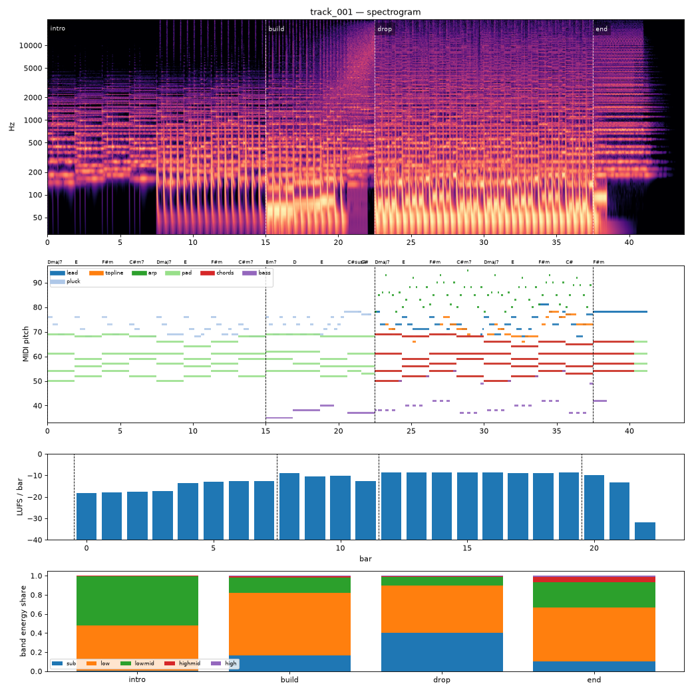

# Render report — track_001_v004

- song: `track_001` | key F# minor | 128 BPM | 4 sections | 43.8s
- git: `c327484e83` (dirty) | spec hash `921d576d21bf31e8` | seed 1001

## Layer 1 — rule checks
- **WARN** `range` 1 notes outside topline range G3-F5 (e.g. F#5 at beat 73.5) _topline_
- **WARN** `mix.kick_bass_overlap` Kick/bass low-band overlap 0.36 _kick,bass_
- **INFO** `melody.nonchord_strong` E5 held 0.75 beats on strong beat over F#m (tension) _lead@beat56_
- **INFO** `melody.nonchord_strong` E5 held 0.5 beats on strong beat over F#m (tension) _lead@beat75_
- **INFO** `melody.nonchord_strong` B4 held 1 beats on strong beat over Dmaj7 (tension) _topline@beat50_
- **INFO** `melody.nonchord_strong` E5 held 1 beats on strong beat over F#m (tension) _topline@beat58_
- **INFO** `melody.nonchord_strong` B4 held 1 beats on strong beat over Dmaj7 (tension) _topline@beat66_
- **INFO** `melody.nonchord_strong` E5 held 0.5 beats on strong beat over F#m (tension) _topline@beat73_
- **INFO** `melody.nonchord_strong` E5 held 1 beats on strong beat over F#m (tension) _topline@beat75_
- **INFO** `motif.ok` Motifs repeated+transformed: ['a'] (uses: {'a': 8, 'frag': 2}) _melody_

## Layer 2 — acoustic diagnostics (not a quality score)

| metric | value |
|---|---|
| lufs_integrated | -10.61 |
| true_peak_dbtp | -1.04 |
| peak_dbfs | -1.05 |
| rms_dbfs | -11.91 |
| crest_db | 10.86 |
| side_to_mid_db | -12.64 |
| lr_correlation | 0.90 |
| master gain into limiter (dB) | -0.42 |
| limiter max gain reduction (dB) | 4.31 |

### Sections

| section | energy tgt | LUFS | centroid Hz | rolloff Hz | onsets/s | side/mid dB | side/mid >300 Hz | sub | low | lowmid | highmid | high |
|---|---|---|---|---|---|---|---|---|---|---|---|---|
| intro | 0.3 | -14.7 | 794 | 1449 | 2.4 | -9.5 | -7.8 | 0.002 | 0.479 | 0.515 | 0.004 | 0.000 |
| build | 0.6 | -10.3 | 1753 | 3508 | 3.6 | -14.8 | -8.0 | 0.169 | 0.651 | 0.160 | 0.014 | 0.007 |
| drop | 1.0 | -8.6 | 2915 | 7165 | 4.1 | -13.8 | -4.6 | 0.404 | 0.492 | 0.092 | 0.010 | 0.003 |
| end | 0.4 | -11.2 | 3516 | 8512 | 0.0 | -7.8 | -3.6 | 0.102 | 0.565 | 0.263 | 0.058 | 0.012 |

### Section contrast
- intro → build: ΔLUFS 4.4, Δcentroid 958 Hz, Δonsets/s 1.2, Δwidth -5.3 dB (>300 Hz: -0.1 dB)
- build → drop: ΔLUFS 1.7, Δcentroid 1163 Hz, Δonsets/s 0.5, Δwidth 1.0 dB (>300 Hz: 3.4 dB)
- drop → end: ΔLUFS -2.6, Δcentroid 601 Hz, Δonsets/s -4.1, Δwidth 6.0 dB (>300 Hz: 1.0 dB)

### Loudness by bar (LUFS)

0:-18 1:-18 2:-18 3:-17 4:-14 5:-13 6:-13 7:-13 8:-9 9:-11 10:-10 11:-13 12:-9 13:-9 14:-9 15:-9 16:-9 17:-9 18:-9 19:-9 20:-10 21:-13 22:-32 23:–

### Stem diagnostics
- kick_bass: low_overlap_ratio=0.358, kick_to_bass_low_db=5.435
- lead_presence: lead_to_rest_1k5k_db=3.545, active_fraction=0.417
- low_end_stereo: side_to_mid_db=-30.597, lr_correlation=0.998

### Tonality
- declared: F# minor (rank 1); estimate: F# minor (0.76), C# minor (0.75), A major (0.66)

## Layer 3 / 4
Critic reviews go to `critiques/`, human A/B choices to `feedback/preferences.jsonl`.

