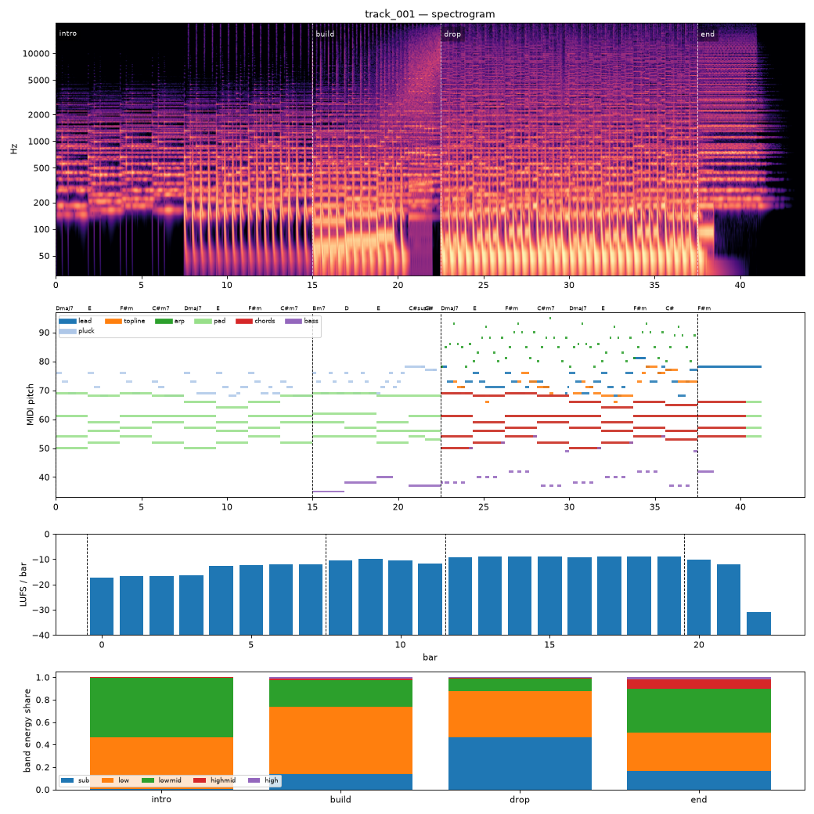

# Render report — track_001_v005

- song: `track_001` | key F# minor | 128 BPM | 4 sections | 43.8s
- git: `c327484e83` (dirty) | spec hash `921d576d21bf31e8` | seed 1001

## Layer 1 — rule checks
- **WARN** `range` 1 notes outside topline range G3-F5 (e.g. F#5 at beat 73.5) _topline_
- **WARN** `mix.kick_bass_overlap` Kick/bass low-band overlap 0.39 _kick,bass_
- **INFO** `melody.nonchord_strong` E5 held 0.75 beats on strong beat over F#m (tension) _lead@beat56_
- **INFO** `melody.nonchord_strong` E5 held 0.5 beats on strong beat over F#m (tension) _lead@beat75_
- **INFO** `melody.nonchord_strong` B4 held 1 beats on strong beat over Dmaj7 (tension) _topline@beat50_
- **INFO** `melody.nonchord_strong` E5 held 1 beats on strong beat over F#m (tension) _topline@beat58_
- **INFO** `melody.nonchord_strong` B4 held 1 beats on strong beat over Dmaj7 (tension) _topline@beat66_
- **INFO** `melody.nonchord_strong` E5 held 0.5 beats on strong beat over F#m (tension) _topline@beat73_
- **INFO** `melody.nonchord_strong` E5 held 1 beats on strong beat over F#m (tension) _topline@beat75_
- **INFO** `motif.ok` Motifs repeated+transformed: ['a'] (uses: {'a': 8, 'frag': 2}) _melody_

## Layer 2 — acoustic diagnostics (not a quality score)

| metric | value |
|---|---|
| lufs_integrated | -10.69 |
| true_peak_dbtp | -1.04 |
| peak_dbfs | -1.05 |
| rms_dbfs | -12.12 |
| crest_db | 11.07 |
| side_to_mid_db | -11.65 |
| lr_correlation | 0.87 |
| master gain into limiter (dB) | 0.66 |
| limiter max gain reduction (dB) | 4.95 |

### Sections

| section | energy tgt | LUFS | centroid Hz | rolloff Hz | onsets/s | side/mid dB | side/mid >300 Hz | sub | low | lowmid | highmid | high |
|---|---|---|---|---|---|---|---|---|---|---|---|---|
| intro | 0.3 | -14.0 | 812 | 1488 | 2.7 | -9.2 | -7.7 | 0.002 | 0.464 | 0.530 | 0.004 | 0.000 |
| build | 0.6 | -10.6 | 1962 | 3944 | 3.7 | -13.2 | -8.0 | 0.137 | 0.603 | 0.231 | 0.019 | 0.010 |
| drop | 1.0 | -8.8 | 2957 | 7249 | 4.0 | -13.1 | -4.7 | 0.464 | 0.410 | 0.111 | 0.012 | 0.003 |
| end | 0.4 | -11.0 | 3815 | 8976 | 0.0 | -6.1 | -3.6 | 0.164 | 0.341 | 0.393 | 0.085 | 0.018 |

### Section contrast
- intro → build: ΔLUFS 3.4, Δcentroid 1149 Hz, Δonsets/s 1.0, Δwidth -4.0 dB (>300 Hz: -0.3 dB)
- build → drop: ΔLUFS 1.8, Δcentroid 995 Hz, Δonsets/s 0.3, Δwidth 0.1 dB (>300 Hz: 3.3 dB)
- drop → end: ΔLUFS -2.2, Δcentroid 858 Hz, Δonsets/s -4.0, Δwidth 7.0 dB (>300 Hz: 1.0 dB)

### Loudness by bar (LUFS)

0:-17 1:-17 2:-17 3:-16 4:-13 5:-12 6:-12 7:-12 8:-10 9:-10 10:-11 11:-12 12:-9 13:-9 14:-9 15:-9 16:-9 17:-9 18:-9 19:-9 20:-10 21:-12 22:-31 23:–

### Stem diagnostics
- kick_bass: low_overlap_ratio=0.394, kick_to_bass_low_db=9.702
- lead_presence: lead_to_rest_1k5k_db=3.532, active_fraction=0.417
- low_end_stereo: side_to_mid_db=-29.760, lr_correlation=0.998

### Tonality
- declared: F# minor (rank 2); estimate: C# minor (0.78), F# minor (0.77), A major (0.69)

## Layer 3 / 4
Critic reviews go to `critiques/`, human A/B choices to `feedback/preferences.jsonl`.

