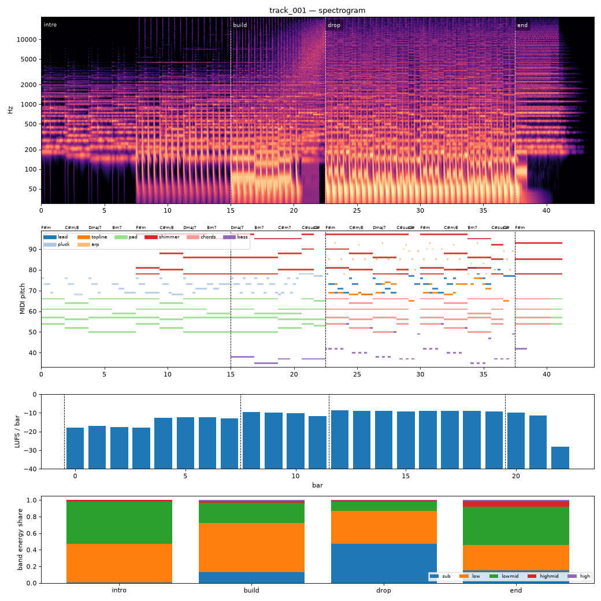

# Render report — track_001_v006

- song: `track_001` | key F# minor | 128 BPM | 4 sections | 43.8s
- git: `fe3d64d983` (dirty) | spec hash `684150a081251944` | seed 1001

## Layer 1 — rule checks
- **WARN** `mix.kick_bass_overlap` Kick/bass low-band overlap 0.39 _kick,bass_
- **INFO** `melody.nonchord_strong` B4 held 1 beats on strong beat over F#m (tension) _lead@beat50_
- **INFO** `melody.nonchord_strong` B4 held 1 beats on strong beat over Dmaj7 (tension) _lead@beat58_
- **INFO** `melody.nonchord_strong` E5 held 0.5 beats on strong beat over F#m (tension) _lead@beat64_
- **INFO** `melody.nonchord_strong` B4 held 1 beats on strong beat over F#m (tension) _lead@beat66_
- **INFO** `melody.nonchord_strong` E5 held 1 beats on strong beat over Bm7 (tension) _lead@beat74_
- **INFO** `melody.nonchord_strong` E5 held 1.5 beats on strong beat over Bm7 (tension) _topline@beat73_
- **INFO** `motif.ok` Motifs repeated+transformed: ['a'] (uses: {'a': 5, 'frag': 2}) _melody_

## Layer 2 — acoustic diagnostics (not a quality score)

| metric | value |
|---|---|
| lufs_integrated | -10.66 |
| true_peak_dbtp | -1.04 |
| peak_dbfs | -1.05 |
| rms_dbfs | -12.17 |
| crest_db | 11.12 |
| side_to_mid_db | -10.97 |
| lr_correlation | 0.85 |
| master gain into limiter (dB) | 0.23 |
| limiter max gain reduction (dB) | 4.89 |

### Sections

| section | energy tgt | LUFS | centroid Hz | rolloff Hz | onsets/s | side/mid dB | side/mid >300 Hz | sub | low | lowmid | highmid | high |
|---|---|---|---|---|---|---|---|---|---|---|---|---|
| intro | 0.3 | -14.3 | 857 | 1587 | 2.5 | -7.8 | -6.0 | 0.002 | 0.470 | 0.511 | 0.017 | 0.000 |
| build | 0.6 | -10.3 | 1984 | 3925 | 4.0 | -12.4 | -7.2 | 0.130 | 0.595 | 0.241 | 0.024 | 0.009 |
| drop | 1.0 | -8.9 | 3020 | 7440 | 4.1 | -12.6 | -4.1 | 0.472 | 0.399 | 0.111 | 0.015 | 0.003 |
| end | 0.4 | -10.6 | 3650 | 8539 | 0.0 | -5.9 | -3.7 | 0.153 | 0.303 | 0.464 | 0.070 | 0.011 |

### Section contrast
- intro → build: ΔLUFS 4.0, Δcentroid 1127 Hz, Δonsets/s 1.5, Δwidth -4.5 dB (>300 Hz: -1.1 dB)
- build → drop: ΔLUFS 1.5, Δcentroid 1035 Hz, Δonsets/s 0.1, Δwidth -0.2 dB (>300 Hz: 3.1 dB)
- drop → end: ΔLUFS -1.8, Δcentroid 630 Hz, Δonsets/s -4.1, Δwidth 6.7 dB (>300 Hz: 0.4 dB)

### Loudness by bar (LUFS)

0:-18 1:-17 2:-18 3:-18 4:-13 5:-12 6:-12 7:-13 8:-9 9:-10 10:-10 11:-12 12:-9 13:-9 14:-9 15:-9 16:-9 17:-9 18:-9 19:-9 20:-10 21:-12 22:-28 23:–

### Stem diagnostics
- kick_bass: low_overlap_ratio=0.393, kick_to_bass_low_db=9.701
- lead_presence: lead_to_rest_1k5k_db=2.208, active_fraction=0.421
- low_end_stereo: side_to_mid_db=-29.205, lr_correlation=0.998

### Tonality
- declared: F# minor (rank 1); estimate: F# minor (0.83), C# minor (0.74), A major (0.67)

## Layer 3 / 4
Critic reviews go to `critiques/`, human A/B choices to `feedback/preferences.jsonl`.

