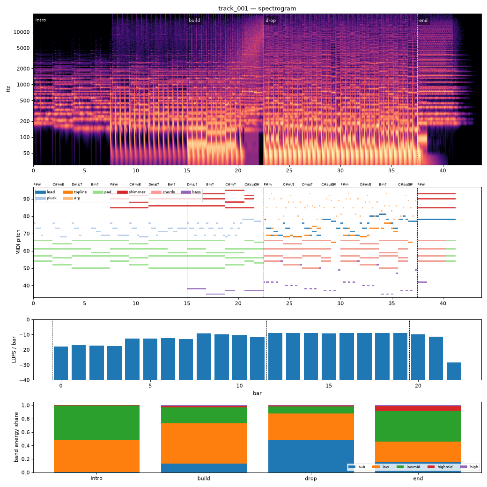

# Render report — track_001_v007

- song: `track_001` | key F# minor | 128 BPM | 4 sections | 43.8s
- git: `fe3d64d983` (dirty) | spec hash `d2cda81a7af21433` | seed 1001

## Layer 1 — rule checks
- **WARN** `mix.kick_bass_overlap` Kick/bass low-band overlap 0.39 _kick,bass_
- **INFO** `melody.nonchord_strong` B4 held 1 beats on strong beat over F#m (tension) _lead@beat50_
- **INFO** `melody.nonchord_strong` B4 held 1 beats on strong beat over Dmaj7 (tension) _lead@beat58_
- **INFO** `melody.nonchord_strong` E5 held 0.5 beats on strong beat over F#m (tension) _lead@beat64_
- **INFO** `melody.nonchord_strong` B4 held 1 beats on strong beat over F#m (tension) _lead@beat66_
- **INFO** `melody.nonchord_strong` E5 held 1 beats on strong beat over Bm7 (tension) _lead@beat74_
- **INFO** `melody.nonchord_strong` E5 held 1.5 beats on strong beat over Bm7 (tension) _topline@beat73_
- **INFO** `motif.ok` Motifs repeated+transformed: ['a'] (uses: {'a': 5, 'frag': 2}) _melody_

## Layer 2 — acoustic diagnostics (not a quality score)

| metric | value |
|---|---|
| lufs_integrated | -10.67 |
| true_peak_dbtp | -1.04 |
| peak_dbfs | -1.05 |
| rms_dbfs | -12.09 |
| crest_db | 11.04 |
| side_to_mid_db | -11.57 |
| lr_correlation | 0.87 |
| master gain into limiter (dB) | 0.48 |
| limiter max gain reduction (dB) | 4.82 |

### Sections

| section | energy tgt | LUFS | centroid Hz | rolloff Hz | onsets/s | side/mid dB | side/mid >300 Hz | sub | low | lowmid | highmid | high |
|---|---|---|---|---|---|---|---|---|---|---|---|---|
| intro | 0.3 | -14.3 | 1198 | 1917 | 2.1 | -8.2 | -6.5 | 0.002 | 0.476 | 0.516 | 0.005 | 0.000 |
| build | 0.6 | -10.3 | 2165 | 4119 | 4.1 | -13.0 | -7.8 | 0.132 | 0.600 | 0.238 | 0.020 | 0.009 |
| drop | 1.0 | -8.9 | 3045 | 7566 | 4.1 | -13.5 | -5.0 | 0.477 | 0.401 | 0.107 | 0.012 | 0.003 |
| end | 0.4 | -10.6 | 3716 | 8706 | 0.0 | -6.1 | -4.0 | 0.151 | 0.307 | 0.457 | 0.074 | 0.012 |

### Section contrast
- intro → build: ΔLUFS 4.0, Δcentroid 966 Hz, Δonsets/s 2.0, Δwidth -4.8 dB (>300 Hz: -1.3 dB)
- build → drop: ΔLUFS 1.4, Δcentroid 880 Hz, Δonsets/s 0.0, Δwidth -0.5 dB (>300 Hz: 2.8 dB)
- drop → end: ΔLUFS -1.7, Δcentroid 671 Hz, Δonsets/s -4.1, Δwidth 7.4 dB (>300 Hz: 1.0 dB)

### Loudness by bar (LUFS)

0:-18 1:-17 2:-17 3:-18 4:-13 5:-13 6:-12 7:-13 8:-9 9:-10 10:-10 11:-12 12:-9 13:-9 14:-9 15:-9 16:-9 17:-9 18:-9 19:-9 20:-10 21:-11 22:-28 23:–

### Stem diagnostics
- kick_bass: low_overlap_ratio=0.393, kick_to_bass_low_db=9.701
- lead_presence: lead_to_rest_1k5k_db=4.116, active_fraction=0.421
- low_end_stereo: side_to_mid_db=-29.205, lr_correlation=0.998

### Tonality
- declared: F# minor (rank 1); estimate: F# minor (0.86), C# minor (0.70), A major (0.68)

## Layer 3 / 4
Critic reviews go to `critiques/`, human A/B choices to `feedback/preferences.jsonl`.

