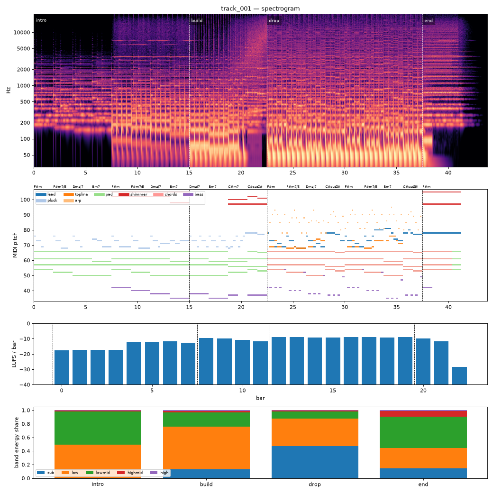

# Render report — track_001_v008

- song: `track_001` | key F# minor | 128 BPM | 4 sections | 43.8s
- git: `7263d4ced8` (dirty) | spec hash `bfd2e68ee37e50ab` | seed 1001

## Layer 1 — rule checks
- **WARN** `mix.kick_bass_overlap` Kick/bass low-band overlap 0.37 _kick,bass_
- **INFO** `melody.nonchord_strong` B4 held 1 beats on strong beat over F#m (tension) _lead@beat50_
- **INFO** `melody.nonchord_strong` B4 held 1 beats on strong beat over Dmaj7 (tension) _lead@beat58_
- **INFO** `melody.nonchord_strong` E5 held 0.5 beats on strong beat over F#m (tension) _lead@beat64_
- **INFO** `melody.nonchord_strong` B4 held 1 beats on strong beat over F#m (tension) _lead@beat66_
- **INFO** `melody.nonchord_strong` E5 held 1.5 beats on strong beat over Bm7 (tension) _topline@beat73_
- **INFO** `motif.ok` Motifs repeated+transformed: ['a', 'frag'] (uses: {'a': 5, 'frag': 2}) _melody_

## Layer 2 — acoustic diagnostics (not a quality score)

| metric | value |
|---|---|
| lufs_integrated | -10.65 |
| true_peak_dbtp | -1.04 |
| peak_dbfs | -1.05 |
| rms_dbfs | -12.09 |
| crest_db | 11.04 |
| side_to_mid_db | -11.80 |
| lr_correlation | 0.88 |
| master gain into limiter (dB) | 0.30 |
| limiter max gain reduction (dB) | 4.99 |

### Sections

| section | energy tgt | LUFS | centroid Hz | rolloff Hz | onsets/s | side/mid dB | side/mid >300 Hz | sub | low | lowmid | highmid | high |
|---|---|---|---|---|---|---|---|---|---|---|---|---|
| intro | 0.3 | -13.9 | 1625 | 3027 | 2.2 | -9.1 | -7.4 | 0.002 | 0.491 | 0.487 | 0.018 | 0.003 |
| build | 0.6 | -10.5 | 2071 | 4101 | 3.6 | -13.9 | -8.5 | 0.133 | 0.628 | 0.209 | 0.021 | 0.009 |
| drop | 1.0 | -8.9 | 3011 | 7448 | 4.0 | -13.1 | -4.7 | 0.475 | 0.401 | 0.109 | 0.012 | 0.003 |
| end | 0.4 | -10.5 | 3795 | 8826 | 0.0 | -6.9 | -4.8 | 0.145 | 0.298 | 0.462 | 0.080 | 0.014 |

### Section contrast
- intro → build: ΔLUFS 3.4, Δcentroid 446 Hz, Δonsets/s 1.4, Δwidth -4.8 dB (>300 Hz: -1.0 dB)
- build → drop: ΔLUFS 1.6, Δcentroid 941 Hz, Δonsets/s 0.4, Δwidth 0.8 dB (>300 Hz: 3.7 dB)
- drop → end: ΔLUFS -1.6, Δcentroid 784 Hz, Δonsets/s -4.0, Δwidth 6.2 dB (>300 Hz: -0.1 dB)

### Loudness by bar (LUFS)

0:-17 1:-17 2:-17 3:-17 4:-12 5:-12 6:-12 7:-13 8:-10 9:-10 10:-11 11:-12 12:-9 13:-9 14:-9 15:-9 16:-9 17:-9 18:-9 19:-9 20:-10 21:-12 22:-28 23:–

### Stem diagnostics
- kick_bass: low_overlap_ratio=0.367, kick_to_bass_low_db=9.020
- lead_presence: lead_to_rest_1k5k_db=3.877, active_fraction=0.421
- low_end_stereo: side_to_mid_db=-29.185, lr_correlation=0.998

### Tonality
- declared: F# minor (rank 1); estimate: F# minor (0.90), A major (0.66), C# minor (0.60)

## Layer 3 / 4
Critic reviews go to `critiques/`, human A/B choices to `feedback/preferences.jsonl`.

